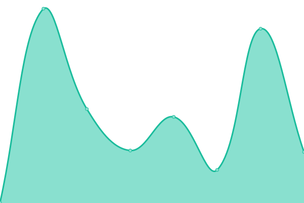
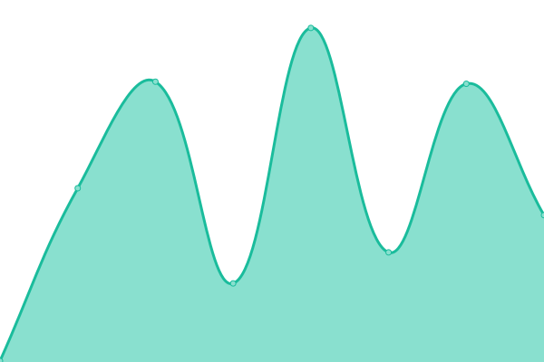
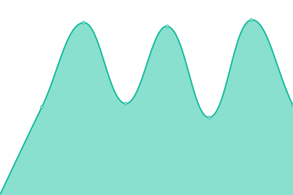
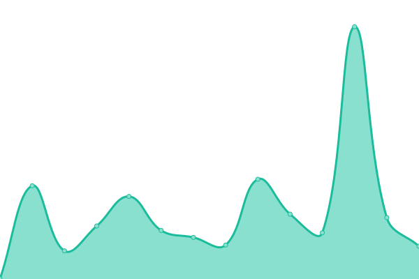

# [📈 Live Status](https://svilaa.github.io/websites-status): <!--live status--> **🟩 All systems operational**

This repository contains the open-source uptime monitor and status page for [Sergi Vila Almenara](https://svilaa.github.io/websites-status), powered by [Upptime](https://github.com/upptime/upptime).

With [Upptime](https://upptime.js.org), you can get your own unlimited and free uptime monitor and status page, powered entirely by a GitHub repository. We use [Issues](https://github.com/svilaa/websites-status/issues) as incident reports, [Actions](https://github.com/svilaa/websites-status/actions) as uptime monitors, and [Pages](https://svilaa.github.io/websites-status) for the status page.

<!--start: status pages-->
<!-- This summary is generated by Upptime (https://github.com/upptime/upptime) -->
<!-- Do not edit this manually, your changes will be overwritten -->
<!-- prettier-ignore -->
| URL | Status | History | Response Time | Uptime |
| --- | ------ | ------- | ------------- | ------ |
|  [Print & Go App](https://www.printandgo.app) | 🟩 Up | [print-and-go-app.yml](https://github.com/svilaa/websites-status/commits/HEAD/history/print-and-go-app.yml) | 

 573ms
     
 | 

<a href="https://svilaa.github.io/websites-status/history/print-and-go-app">100.00%</a>
    

|  [Aurora Cloud App](https://www.auroracloud.app) | 🟩 Up | [aurora-cloud-app.yml](https://github.com/svilaa/websites-status/commits/HEAD/history/aurora-cloud-app.yml) | 

 738ms
     
 | 

<a href="https://svilaa.github.io/websites-status/history/aurora-cloud-app">100.00%</a>
    

|  [Invelon](https://invelon.com) | 🟩 Up | [invelon.yml](https://github.com/svilaa/websites-status/commits/HEAD/history/invelon.yml) | 

 460ms
     
 | 

<a href="https://svilaa.github.io/websites-status/history/invelon">100.00%</a>
    

|  [Intech3D](https://intech3d.es) | 🟩 Up | [intech3-d.yml](https://github.com/svilaa/websites-status/commits/HEAD/history/intech3-d.yml) | 

 7836ms
     
 | 

<a href="https://svilaa.github.io/websites-status/history/intech3-d">100.00%</a>
    

|  [Ingroup](https://ingroup.biz) | 🟩 Up | [ingroup.yml](https://github.com/svilaa/websites-status/commits/HEAD/history/ingroup.yml) | 

 1418ms
     
 | 

<a href="https://svilaa.github.io/websites-status/history/ingroup">100.00%</a>
    

|  [Print & Go](https://printandgo.tech) | 🟩 Up | [print-and-go.yml](https://github.com/svilaa/websites-status/commits/HEAD/history/print-and-go.yml) | 

 3459ms
     
 | 

<a href="https://svilaa.github.io/websites-status/history/print-and-go">100.00%</a>
    

|  [XRshop](https://xrshop.invelon.com) | 🟩 Up | [x-rshop.yml](https://github.com/svilaa/websites-status/commits/HEAD/history/x-rshop.yml) | 

 386ms
     
 | 

<a href="https://svilaa.github.io/websites-status/history/x-rshop">100.00%</a>
    

|  [InGameVR](https://ingamevr.com) | 🟩 Up | [in-game-vr.yml](https://github.com/svilaa/websites-status/commits/HEAD/history/in-game-vr.yml) | 

 3322ms
     
 | 

<a href="https://svilaa.github.io/websites-status/history/in-game-vr">99.71%</a>
    

|  [Aulas Ateca](https://aulasateca.com) | 🟩 Up | [aulas-ateca.yml](https://github.com/svilaa/websites-status/commits/HEAD/history/aulas-ateca.yml) | 

 327ms
     
 | 

<a href="https://svilaa.github.io/websites-status/history/aulas-ateca">100.00%</a>
    

|  [Innitia Studio](https://www.innitia.studio) | 🟩 Up | [innitia-studio.yml](https://github.com/svilaa/websites-status/commits/HEAD/history/innitia-studio.yml) | 

 463ms
     
 | 

<a href="https://svilaa.github.io/websites-status/history/innitia-studio">100.00%</a>
    

<!--end: status pages-->

[**Visit our status website →**](https://svilaa.github.io/websites-status)

## 📄 License

- Powered by: [Upptime](https://github.com/upptime/upptime)
- Code: [MIT](./LICENSE) © [Sergi Vila Almenara](https://svilaa.github.io/websites-status)
- Data in the `./history` directory: [Open Database License](https://opendatacommons.org/licenses/odbl/1-0/)
